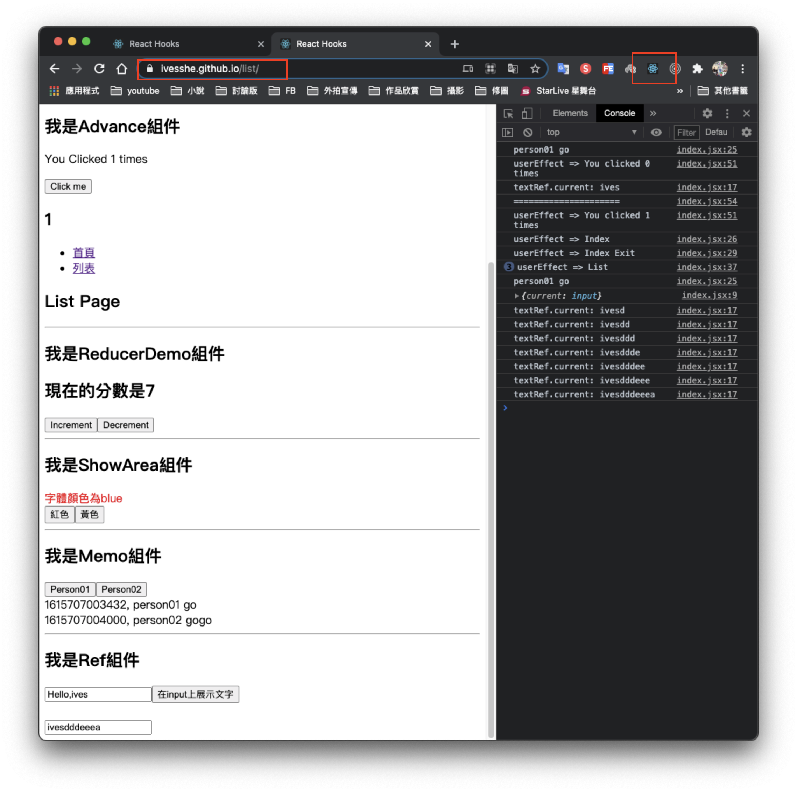
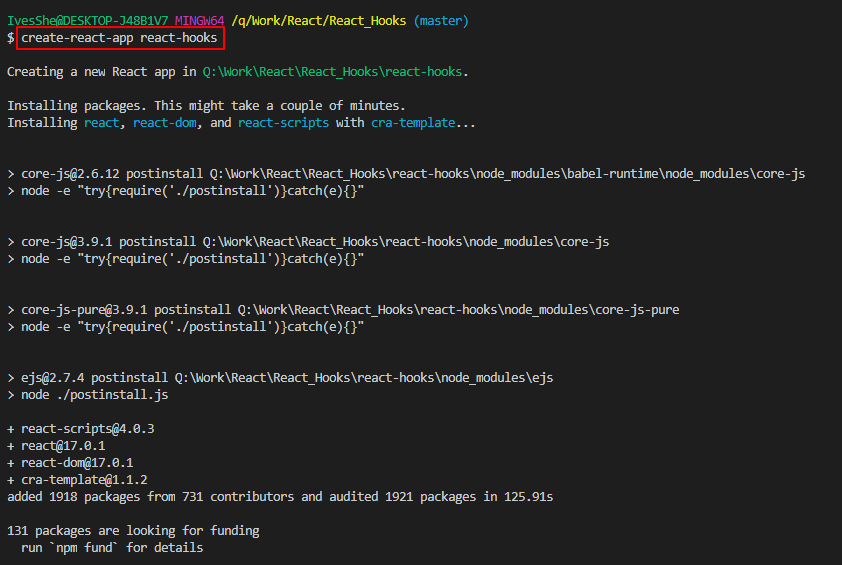
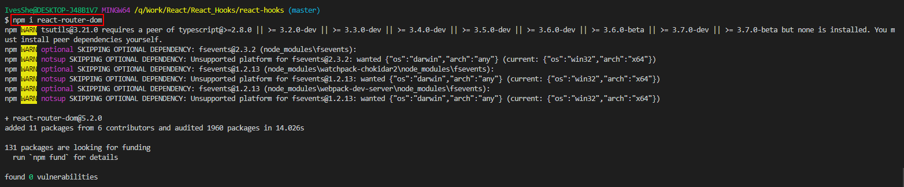
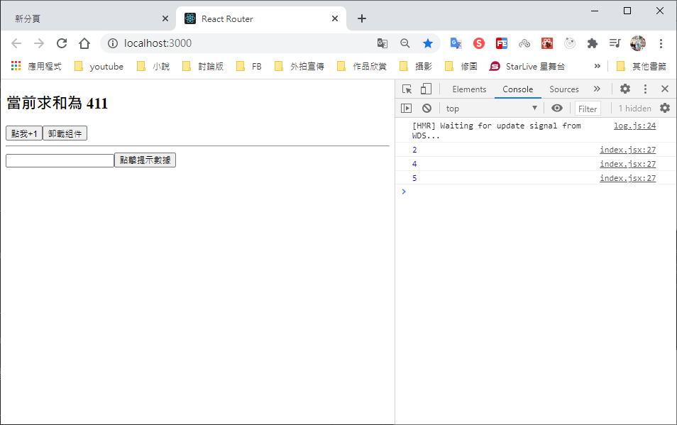

# React Hooks

Github展示

https://ivesshe.github.io/React_Hooks/



# React Hook/Hooks

1. Hook是react 16.8.0 版本增加的新特性/新語法
2. 可以在函數式組件中使用state以及其它的React特性

# 三個常用的Hook

1. State Hook: React.useState()
2. Effect Hook: React.useEffect()
3. Ref Hook: React.Ref()

# State Hook

1. State Hook讓函數組件也可以有state狀態，並進行狀態數據的讀寫操作

2. 語法
```jsx
const [xxx,setxxx] = React.use(initValue)
```

3. useState()說明：
    - 參數：第一次初始化指定的值在內部作緩存
    - 返回值：包含2個元素的數組，第1個為內部當前狀態值，第2個為要更新狀態值的函數

4. setXXX 2種寫法
    - setXXX(newValue): 參數為非函數值，直接指定新的狀態值，內部用其覆蓋原來的狀態值
    - setXXX(value => newValue): 參數為函數，接收原本的狀態值，返回新的狀態值，內部用其覆蓋原來的狀態值


# 創建項目

```bash
create-react-app react-hooks
```



# 簡化檔案結構

創建完成之後，刪除不要的檔案

最後只留四個檔案

詳細可參考之前項目

https://github.com/IvesShe/React_Router

# Effect Hook

1. Effect Hook可以讓你在函數組件中執行副作用操作(用於模擬類式組件的生命周期鉤子)

2. React中的副作用操作：
    - 發ajax請求數據獲取
    - 設置訂閱 / 啟動定時器
    - 手動更改真實DOM

3. 語法和說明：
```jsx
useEffect(()=>{
    // 在此可以執行任何帶副作用操作

    return ()=>{    // 在組件卸載時執行
        // 在此作一些收尾工作，比如清除定時器 / 取消訂閱等
    }
},[stateValue]) // 如果指定是[]，回調函數只會在第一次render()後執行
```

4. 可以把useEffect Hook看作如下三個函數的組合
    - componentDidMount()
    - componentDidUpdate()
    - componentWillUnmount()

# Ref Hook

1. Ref Hook可以在函數組件中存儲 / 查找組件內的標籤或任意其它數據
2. 語法
```jsx
const refContainer = useRef()
```

3. 作用：保存標籤對象，功能與React.createRef()一樣


# 其它補充

# setState更新狀態的2種寫法

1. setState(stateChange, [callback]) --- 對象式的setState
    - stateChange為狀態改變的對象(該對象可以體現出狀態的更改)
    - callback是可選的回調函數，它在函數更新完畢、界面也更新後(render調用後)才被調用

2. setState(updater, [callback]) --- 函數式的setState
    - updater為返回stateChange對象的函數
    - updater可以接收到state和props
    - callback是可選的回調函數，它在函數更新完畢、界面也更新後(render調用後)才被調用

總結：

- 對象式的setState是函數式的setState的簡寫方式(語法糖)    
- 使用原則
    1. 如果新狀態不依賴於原狀態 -> 使用對象方式
    2. 如果新狀態依賴原狀態 -> 使用函數方
    3. 如果需要在setState()執行後獲取最新的狀態數據，要在第二個callback函數中讀取

# 路由組件的lazyLoad

lazyLoad需要時再加載

1. 通過React的lazy函數配合import()函數動態加載路由組件 => 路由組件代碼會被分開打包
```jsx
const Login = lazy(()=>import('@/pages/Login'))
```

```jsx
2. 通過<Suspense>指定在加載得到路由打包文件前顯示一個自定義loading界面

<Suspense fallback={<h1>Loading.....</h1>}>
    <Switch>
        <Route path='/xxx' component={xxxx}>
        <Rediret to="/login" />
    </Switch>
</Suspense>
```

## 安裝react-router-dom

```bash
npm i react-router-dom
```



## 使用方式

可參考此項目的代碼練習

https://github.com/IvesShe/React_Router/


在需要的組件index.jsx增加
```jsx
import {lazy,Suspense} from 'react'
```
```jsx
const Home = lazy(()=>import('./Home'))
const About = lazy(()=>import('./About'))
```
```jsx
<Suspense fallback={<h1>Loading.....</h1>}>
    <Switch>
        {/*註冊路由*/}
        <Route path='/about' component={About}>
        <Route path='/home' component={Home}>
        <Rediret to="/about" />
    </Switch>
</Suspense>
```

```jsx
<h1>Loading.....</h1> 可以獨立作一個Loading組件
但此組件不能作成lazy組件
```

# Fragment

## 使用

```jsx
import React, { Component,Fragment } from 'react'
```
```jsx
<Fragment>
/<Fragment>
```

<Fragment>可以指定key(只能給key)，<>空標籤不行

## 作用

可以不用必須有一個真實的DOM根標籤了


# 執行畫面



# Github上傳
可以參考之前的文檔

https://github.com/IvesShe/React_TodoList